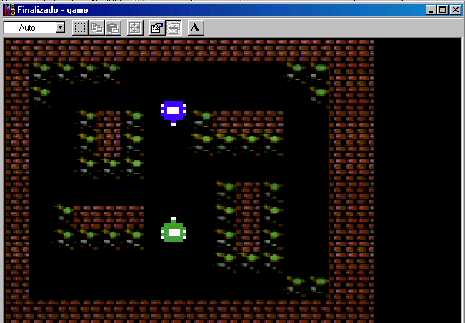

# CutreGameMSDOS



A two player tank game for MS-DOS, written in Borland Turbo C++ 3.0.

*Un juego de tanques para dos jugadores en MS-DOS, escrito en Borland Turbo C++ 3.0.*

---

## English

This is a small game, made in Turbo C++ 3.0 for MS-DOS. To build it you need
the MS-DOS version of NASM installed in `c:\nasm` and added to the system
PATH. This code was written on a real Pentium III running Windows 98.

This game is a port of another game I made for the Commodore 64 in assembly.
That one I did 100% with my own hands, and here is the repository:

**[Commodore 64 version](https://github.com/tsw1985/CutreGameC64)**

I leaned on a YouTube course I had taken beforehand.

For this version I reused a small program I wrote years ago to draw a BMP file
into video memory. With AI I adapted it as I needed changes, but the base was
made by me.

As for the game mechanics, I also built a solid base myself, and then used AI
to help me move the development forward, but it is the same logic I applied
for the Commodore 64 version.

As for the sound, here I did lean 100% on AI to develop it. I had the concepts
of DMA and so on in my head, but I admit it is very technical and complex for
me to have developed on my own. It would have taken me a long time. This has
been a hobby. In this project I wanted to use AI to learn, and to have it
teach me all these technical things that on my own would have taken me a very
long time to work out and understand. With AI I have that teacher on hand 24
hours a day.

I hope you like the game.

### Controls

| | Player 1 | Player 2 |
|---|---|---|
| Move | Arrow keys | W / A / S / D |
| Fire | Keypad 5 | G |
| Quit | Esc | |

### Building

```
make
```

Requires Borland Turbo C++ 3.0 (`tcc`) and NASM for MS-DOS in `c:\nasm`, both
on the PATH. The executable is built into `bin\game.exe` and must be run from
that directory, since it looks for its resources in `..\res\`.

Sound is optional: if no Sound Blaster is found the game runs exactly the
same, in silence. It reads the `BLASTER` environment variable to locate the
card, and falls back to A220 I5 D1.

### Network play

Two machines can play each other over IPX:

```
game.exe /net
```

Both copies find each other on their own by broadcast, so **no IP address is
typed anywhere**. Over the network both players drive with the cursor keys and
fire with keypad 5, whichever tank they get.

In DOSBox, put `ipx=true` in `dosbox.conf`, then `ipxnet startserver` on one
machine and `ipxnet connect <its ip>` on the other. On real DOS, load `LSL`,
your card's ODI driver and `IPXODI` first.

No positions are ever sent: both machines run the whole game and only one byte
of pressed keys per player per frame travels. See
[`src/NETWORK.md`](src/NETWORK.md) for how and why.

---

## Español

Este es un pequeño juego, hecho en Turbo C++ 3.0 para MSDOS. Para poder
compilarlo necesitas tener el NASM versión MSDOS en la ruta `c:\nasm` y
añadirlo en el path del sistema. Este código ha sido hecho usando un equipo
Pentium 3 con Windows 98 real.

Este juego es un port de otro juego que he hecho para Commodore 64 en
ensamblador. Ese sí lo hice yo 100% con mis manos, aquí tienes el repositorio:

**[Versión de Commodore 64](https://github.com/tsw1985/CutreGameC64)**

Apoyándome en un curso que hice en YouTube previamente.

Para esta versión, reusé un pequeño programa que hice hace años para dibujar
en pantalla en memoria de vídeo un fichero BMP. Con la IA lo adapté, según iba
necesitando cambios, pero la base ha sido hecha por mí.

Respecto a la mecánica del juego, también yo hice una buena base, luego con la
IA me ayudé para avanzar el desarrollo, pero es la misma lógica que apliqué
para la versión de Commodore 64.

Respecto al sonido, aquí sí me he apoyado 100% en la IA para desarrollar.
Tenía conceptos en mi cabeza de lo que es DMA, etc., pero reconozco que es muy
técnico y complejo para haberlo desarrollado yo. Hubiera pasado mucho tiempo.
Esto ha sido un hobby. En este proyecto he querido usar la IA para aprender y
que me enseñara todas estas cosas técnicas que por mí mismo hubiera tardado
muchísimo en resolver y aprender. Con la IA tengo ese profesor a mano 24
horas.

Espero que te guste el juego.

### Controles

| | Jugador 1 | Jugador 2 |
|---|---|---|
| Mover | Flechas | W / A / S / D |
| Disparar | 5 del teclado numérico | G |
| Salir | Esc | |

### Compilación

```
make
```

Necesita Borland Turbo C++ 3.0 (`tcc`) y NASM para MSDOS en `c:\nasm`, los dos
en el PATH. El ejecutable se genera en `bin\game.exe` y hay que ejecutarlo
desde ahí, porque busca los recursos en `..\res\`.

El sonido es opcional: si no encuentra una Sound Blaster el juego funciona
exactamente igual, en silencio. Lee la variable de entorno `BLASTER` para
localizar la tarjeta, y si no está asume A220 I5 D1.

### Juego en red

Dos máquinas pueden jugar entre ellas por IPX:

```
game.exe /net
```

Las dos copias se encuentran solas por broadcast, así que **no hay que teclear
ninguna IP en ningún sitio**. En red los dos jugadores se manejan con las
flechas y disparan con el 5 del teclado numérico, dé igual qué tanque les toque.

En DOSBox, pon `ipx=true` en `dosbox.conf`, y luego `ipxnet startserver` en una
máquina e `ipxnet connect <su ip>` en la otra. En DOS real, carga antes `LSL`,
el driver ODI de tu tarjeta e `IPXODI`.

No se manda ninguna posición: las dos máquinas ejecutan el juego entero y solo
viaja un byte de teclas pulsadas por jugador y por frame. El cómo y el porqué,
en [`src/NETWORK.md`](src/NETWORK.md).

---

## Documentación técnica / Technical documentation

- [`src/SOUND.md`](src/SOUND.md) — cómo funciona el sonido: DMA, doble buffer,
  el mezclador por software y el porqué de cada decisión.
- [`src/NETWORK.md`](src/NETWORK.md) — cómo funciona el juego en red: IPX,
  lockstep, el retardo de entrada y la detección de desincronización.
- [`src/sb/FLUJO.md`](src/sb/FLUJO.md) — el reproductor de WAV original del
  que salió el módulo de sonido.
